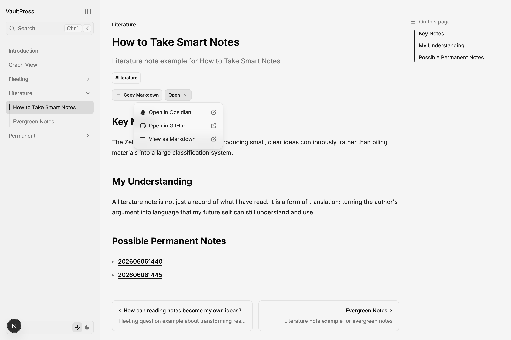

# VaultPress



Publish an Obsidian vault as a documentation site with VaultPress.

## What is VaultPress?

VaultPress turns an **Obsidian vault** into a **documentation site**.

Keep writing in Obsidian as usual. Run `pnpm generate` to sync notes into `content/`, then preview or deploy the site. The stack is [Next.js](https://nextjs.org) + [Fumadocs](https://fumadocs.dev), with Obsidian wikilinks, embeds, callouts, Mermaid, and math.

## Setup

Copy `.env.example` to `.env` and configure:

```bash
# Required for pnpm generate and pnpm obsidian
OBSIDIAN_VAULT_PATH="/path/to/your/vault"

# Optional
SITE_LANGUAGE=en
GENERATE_INCLUDE=fleeting,permanent,literature
SITE_PROTECT_PASSWORD=your-password
```

| Variable | Used by | Description |
| --- | --- | --- |
| `OBSIDIAN_VAULT_PATH` | `pnpm generate`, `pnpm obsidian` | Absolute path to your Obsidian vault (local CLI only) |
| `SITE_LANGUAGE` | Site UI | `en` (default) or `cn` — search, navigation, table of contents |
| `GENERATE_INCLUDE` | `pnpm generate` | Comma-separated top-level folders/files to sync; saved after interactive selection |
| `SITE_PROTECT_PASSWORD` | Site access | Shared password gate for `protected: true` pages (not encryption) |

`OBSIDIAN_VAULT_PATH` is not read when building site links — the server never accesses your local filesystem for page actions.

## Workflow

```text
Obsidian vault → pnpm generate → content/ + public/ → pnpm dev → site
```

1. Edit notes in your Obsidian vault
2. Run `pnpm generate` to convert Markdown into MDX under `content/`, and sync Canvas files into `public/`
3. Run `pnpm dev` to preview locally at http://localhost:3000

`pnpm generate` only reads your vault and writes to `content/` and `public/` — it does not modify notes in Obsidian.

## Commands

| Command | Description |
| --- | --- |
| `pnpm obsidian` | Open the vault configured in `OBSIDIAN_VAULT_PATH` |
| `pnpm generate` | Generate site content from the vault |
| `pnpm generate -- --select` | Re-pick top-level folders and files to include |
| `pnpm dev` | Start the development server |
| `pnpm build` | Build for production |
| `pnpm types:check` | Run MDX generation, Next.js typegen, and TypeScript |
| `pnpm lint` | Run Oxlint |

## Site language

Set `SITE_LANGUAGE` in `.env`:

```bash
SITE_LANGUAGE=en   # English (default)
SITE_LANGUAGE=cn   # 简体中文
```

Restart the dev server after changing it. This changes the site UI only — your note content is not translated.

## Page features

Each documentation page includes:

- **Tags** — From frontmatter `tags` (string or list), shown below the description
- **Copy Markdown** — Copy the processed Markdown for the page
- **Open** menu:
  - **Open in Obsidian** — `obsidian://open?file=…` using the page's public relative path (`.mdx` → `.md`). Opens the note in local Obsidian when your vault mirrors the generated structure.
  - **Open in GitHub** — Link to the page source under `content/` (configure `lib/shared.ts` → `gitConfig` for your repo)
  - **View as Markdown** — Open the raw Markdown endpoint for the page

## Home page

The home page shows a hero section, a dictionary term strip, a **Recently Updated** section (the 6 most recently modified notes by file modification time), and section cards linking to content areas.

## Protected pages

Protected pages use **shared-password access control**. They are **not encrypted**: generated MDX still lives in `content/` like any other page. The site only withholds the **body** and some exports until a visitor proves they know `SITE_PROTECT_PASSWORD`.

Mark a note with frontmatter:

```yaml
protected: true
```

Obsidian may export this as a string (`protected: 'true'`) — both are supported.

Set the shared password in `.env` (never commit this value):

```bash
SITE_PROTECT_PASSWORD=your-password
```

Restart the dev server after changing it. One password unlocks **all** protected pages for that browser session.

### Viewing protected pages

Before unlocking, protected pages stay in the sidebar but their bodies are gated; they are hidden from search, graph, and Markdown endpoints. If someone guesses the URL, they can open the page shell directly — but still **cannot read the body** without the password, for example:

```text
/permanent/202606061435
```

The page **title, description, and tags remain visible** even before unlock. A password form appears **in the body only** — Copy Markdown, View as Markdown, and the Open menu stay hidden until unlocked.

After a correct password, the browser stores an HttpOnly cookie for about 30 days. Requires server deployment (`pnpm build` + `pnpm start`, or Vercel) with HTTPS in production — not static export.

### Security model

**What this scheme is good for**

- Keeping protected note bodies out of casual reading, search, and Markdown export (sidebar links remain visible)
- A simple gate when the site is public but a few pages should need a shared secret
- Pairing with a **private repository** so `content/` is not world-readable on GitHub

**What it does not protect against**

- **Repository or build access** — `content/*.mdx` contains the full source; anyone with repo, CI, or server filesystem access can read it without the password
- **URL guessing** — if someone knows your folder structure, they may find the page URL and see its title, description, and tags before unlock; the **body and Markdown exports remain blocked**
- **Metadata leakage** — title, description, and tags are shown before unlock
- **One password for everything** — there are no per-page or per-user passwords; sharing the password shares access to all protected pages
- **Cookie scope** — one successful unlock grants access to every protected page until the cookie expires
- **Brute force** — `/api/protected-auth` has no built-in rate limiting; use a strong password and HTTPS
- **True secrecy** — this is access gating, not encryption, audit logging, or account-based authorization

**Practical guidance**

- Use a long, unique `SITE_PROTECT_PASSWORD` and keep `.env` out of version control
- Deploy over HTTPS so the HttpOnly cookie is marked `Secure` in production
- For highly sensitive material, do not publish it through `pnpm generate`; keep it only in Obsidian, or use a proper auth system instead

## Directory layout

- `.env` — Vault path, site language, generate selection, protect password
- `content/` — Generated MDX (from `generate`), plus hand-written `index.mdx` and `graph.mdx`
- `public/` — Generated static assets (vault media, Canvas `.canvas` files, and canvas-referenced images/PDFs, etc.)
- `app/` — Next.js pages and routes
- `lib/` — Locale, Obsidian URIs, tags, protected access, canvas parsing, shared config
- `components/canvas-*.tsx` — Canvas viewer (React Flow) and node renderers
- `scripts/generate.ts` — Vault → site generation script (read-only on vault)
- `scripts/generate-canvas-pages.ts` — Syncs canvas files/assets and generates canvas MDX pages
- `scripts/open-obsidian.ts` — Opens the configured vault in Obsidian

## Generation rules

### Cleanup scope

Each `pnpm generate` run starts by deleting previously generated output so removed vault items do not leave stale site files.

| Location | What is removed | What is preserved |
| --- | --- | --- |
| `content/` | Every top-level file and folder | `index.mdx`, `graph.mdx` only |
| `public/` | Everything inside the directory | Nothing |

Examples of items removed from `content/`: note folders (`fleeting/`, `permanent/`, …), generated canvas pages (`canvas/demo.mdx`), and any other generated MDX trees.

Examples of items removed from `public/`: synced `.canvas` files (`canvas/demo.canvas`), canvas-referenced assets (`vaultpress.png`), and other vault media written by `generate`.

After cleanup, `generate` repopulates both directories from the current vault selection:

1. Vault notes and media → `content/` + `public/`
2. Canvas files and their referenced assets → `public/`
3. Canvas page wrappers → `content/`

Do not store hand-maintained static files under `public/` — they will be deleted on the next run. Keep long-lived documentation in `content/index.mdx`, `content/graph.mdx`, or outside the generated output paths.

### Draft exclusion

Notes with `draft: true` or `private: true` in frontmatter are excluded from generation:

```yaml
draft: true
```

This is the primary way to keep notes out of the site while they're still being written. The site will never generate pages for draft notes.

### Include selection

By default, all top-level vault items are included (minus drafts). To curate which folders/files are synced, use `pnpm generate -- --select` to pick interactively. The choice is saved as `GENERATE_INCLUDE` in `.env`. Clear `GENERATE_INCLUDE` to return to "include everything" mode.

Excluded from generation:

- `.obsidian/` — Obsidian configuration
- `templates/` — Note templates

Canvas handling (during `pnpm generate`):

- `.canvas` files under `GENERATE_INCLUDE` are copied from the vault to `public/` (same relative path)
- Media referenced by canvas nodes (images, video, audio, PDF, group backgrounds) are copied into `public/` even when the asset is outside `GENERATE_INCLUDE`
- An MDX wrapper is generated under `content/` for each canvas (for example `public/canvas/demo.canvas` → `content/canvas/demo.mdx`)

Frontmatter handling:

- `title` — Uses the note's `title` field, then the first `#` heading, then the filename
- `description` — Uses the note's `description` field only; omitted if empty
- `tags` — Passed through from Obsidian frontmatter; normalized to a string array for display
- `protected` — When `true` (or `'true'`), gates the page body behind `SITE_PROTECT_PASSWORD` (not encryption)

## Graph View

The [Graph View](/graph) page shows an interactive graph of site pages and wikilink connections. Each node is a page; edges are internal links. Click a node to open that page. Protected pages appear only after unlocking.

## Canvas View

VaultPress publishes [Obsidian Canvas](https://jsoncanvas.org/) files as read-only pages.

### Setup

1. Create or edit `.canvas` files in your vault (for example `canvas/demo.canvas`)
2. Include the canvas folder in `GENERATE_INCLUDE` (or select it during `pnpm generate -- --select`)
3. Run `pnpm generate` — canvas files land in `public/`, and site pages are generated under `content/`
4. Open the page in the site (for example [/canvas/demo](/canvas/demo))

### Supported features

- **Nodes** — text, file, link, and group
- **Edges** — side anchors, arrow ends, colors, labels
- **Colors** — Obsidian presets `1`–`6` and custom hex values
- **Group** — label above the frame; optional background image (`cover` / `ratio` / `repeat`)
- **File** — filename label above the frame; image, video, audio, PDF, and other file types
- **Markdown files** — in-node preview using the same MDX pipeline as documentation pages; click the node background to open the full page; links inside the preview work independently
- **Text** — lightweight Markdown and wikilinks inside the node
- **Interaction** — drag to pan, scroll to zoom

Canvas pages use `full: true` layout (no table of contents) and render inside a fixed-height viewer.

### Limitations (v1)

- Read-only — no editing on the site
- Text nodes use a lightweight Markdown renderer, not full MDX
- `![[note.canvas]]` embeds in notes are not supported yet
- File `subpath` (heading anchors) is appended to links but does not scroll the in-node preview

## Reading affordances

### Reading time

Every docs page shows estimated reading time and word count in the table of contents sidebar, above the local graph. Computed server-side from the page's structured data.

### Reader mode

Toggle distraction-free reading with the book icon in the page actions bar (next to Copy Markdown), or press `Ctrl+B` / `Cmd+B`. Hides the sidebar, table of contents, and mobile TOC popover. The preference persists to localStorage across sessions. Sidenotes automatically fall back to inline popovers when margins disappear.

### Orphan link styling

Wikilinks that reference pages not in the vault are rendered with a wavy amber underline and disabled pointer — immediate visual feedback that a link target is missing.

### Figure image cartridge

Every markdown image is wrapped in a `<figure>` with a `<figcaption>` from the alt text. Images start with a subtle grayscale + 3D tilt (noir effect) and flatten to full color on hover. Respects `prefers-reduced-motion`.

### Embed fade-in

Note transclusion bodies (`![[Note]]`) fade in on render to prevent hydration flash.

### Callout animation

Obsidian callout bodies animate in with a subtle fade + rise on page load.

### Task checkbox styling

GFM task lists (`- [x] Done`) render with custom styled checkboxes — primary color when checked, with a checkmark and strikethrough on completed items.

### Link popover caching

Hover previews for internal links cache fetched HTML in memory. The first hover fetches and cleans the target page; subsequent hovers for the same link are instant.

## Slides

Pages with `slides: true` in frontmatter can be viewed as a full-screen slide presentation.

### Setup

Add `slides: true` to a note's frontmatter:

```yaml
---
title: My Presentation
slides: true
---
```

Structure the content with H1 or H2 headings — each heading starts a new slide. Content before the first heading becomes the title slide.

### Viewing

Visit `/<page-path>/slides` to enter the slide viewer. For example, if the page is at `/foundations/overview`, slides are at `/foundations/overview/slides`.

### Controls

| Key | Action |
|---|---|
| `→` or `Space` | Next slide |
| `←` | Previous slide |
| `Escape` / `×` button | Return to the page |

The URL hash (`#slide-3`) updates as you navigate for deep linking. A progress bar at the top shows position.

A demo page is available at [/slides-demo/slides](/slides-demo/slides).

## Masonry layout

A reusable component for displaying pages in a multi-column card grid:

```tsx
import { MasonryLayout } from '@/components/masonry-layout';

const pages = source.getPages()
  .filter(p => p.slugs[0] === 'history')
  .map(p => ({
    url: p.url,
    title: p.data.title,
    description: p.data.description,
    tags: p.data.tags,
  }));

<MasonryLayout pages={pages} columns={2} />
```

Cards show title, description (3-line clamp), and up to 4 tag chips. Hover lifts the card. Uses CSS `column-count` — no JavaScript layout.

## RSS feed

An RSS 2.0 feed is available at [`/rss.xml`](/rss.xml). It includes all non-protected, non-tag pages (up to 50 items). Feed readers auto-discover it via the `<link rel="alternate">` in the page head.

Set the `SITE_URL` environment variable for absolute URLs in the feed:

```bash
SITE_URL=https://your-domain.com
```

## Stack

- **Framework**: Next.js + Fumadocs + React Flow
- **Content**: Obsidian Markdown → MDX ([fumadocs-obsidian](https://fumadocs.dev/docs/integrations/obsidian))
- **Features**: Full-text search, knowledge graph, Obsidian Canvas, page tags, shared-password page gating, Obsidian/GitHub/Markdown actions, Mermaid, math, sidenotes, link popovers, annotations, backlinks, slides, reader mode, RSS, masonry layout

## TODO

Canvas and follow-up items:

- [ ] Support `![[path/to/canvas.canvas]]` embeds inside notes
- [ ] Render text nodes with the full MDX pipeline (match file-node preview fidelity)
- [ ] Scroll file-node preview to `subpath` heading anchors
- [ ] Add automated tests for canvas parsing and asset sync
- [ ] Document remote image URLs in canvas file nodes (Next.js `images` config)

## Contributing

See [CONTRIBUTING.md](./CONTRIBUTING.md).

## License

[MIT](./LICENSE)
