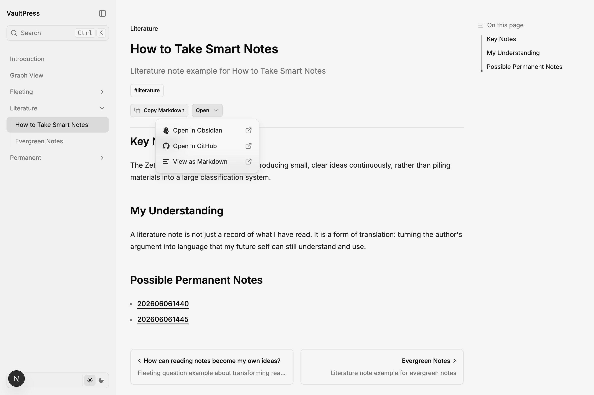

# Alkarkari AFFiNE deployment



This is the private Alkarkari Fumadocs deployment. It consumes the reusable
`@affine-fumadocs/publisher` contract and publishes the collaborative AFFiNE
workspace through the existing Alkarkari frontend.

## Architecture

AFFiNE is the authoring system and source of truth. The local publisher bridge
reads native AFFiNE publication properties, emits a local MDX/media snapshot,
and Fumadocs serves that derived snapshot. Visitors never query AFFiNE directly.

```text
AFFiNE workspace → publisher bridge → affine/<locale> → stage → Fumadocs site
```

The separate `alkarkari` repository remains the frozen Obsidian rollback copy.
This repository defaults to AFFiNE and has no active runtime dependency on the
original vault. The generic product boundary is documented in
[`docs/specs/affine-fumadocs-publisher-v0.1.md`](./docs/specs/affine-fumadocs-publisher-v0.1.md).

## Setup

Copy `.env.publisher.example` to `.env.publisher`, set the workspace ID and the
complete signed-in AFFiNE Cookie header in `AFFINE_BLOB_COOKIE`, then start the
managed read-only publisher service:

```bash
pnpm publisher:watch
pnpm publisher:doctor
pnpm dev
```

The service creates its loopback bridge token locally and keeps it out of Git.
See [the publisher runbook](./docs/operations/affine-publisher.md) for session
rotation and service health checks. The official workspace MCP remains an
explicit manual-snapshot fallback only.

## Workflow

`pnpm publisher:watch` polls AFFiNE and refreshes the snapshot after edits.
`pnpm dev`,
`pnpm types:check`, and `pnpm build` stage that snapshot automatically. Use
`CONTENT_SOURCE=obsidian pnpm dev` only for an explicit comparison against the
frozen pre-cutover locale tree.

### Near-real-time publishing

The default workspace MCP is appropriate for an explicit snapshot. To publish
collaborative edits continuously, run the separate bridge and poller described in
[the publisher runbook](./docs/operations/affine-publisher.md). The poller uses
`DAWNCR0W/affine-mcp-server` to enumerate/export the workspace, regenerates only
when document metadata changes, and stages the new snapshot every 45 seconds by
default. This is near-real-time publishing, not browser-level Yjs collaboration.

### Publishing Studio

In development, open `/publishing` for snapshot freshness, published/draft totals,
collection coverage, portal counts, and actionable editorial diagnostics. The route
is deliberately omitted from production static exports. Public collection surfaces
are configured in [`affine/publishing.config.json`](./affine/publishing.config.json):
each portal maps an AFFiNE collection to a route and explicitly allow-lists the
native properties that may enter `public/affine-publishing.json`. Draft documents
never enter that public contract. See the
[Publishing Studio spec](./docs/specs/affine-publishing-studio.md) for invariants
and extension points.

## Commands

| Command | Description |
| --- | --- |
| `pnpm generate` | Manual official-MCP snapshot fallback |
| `pnpm generate:affine` | Explicit alias for the manual snapshot fallback |
| `pnpm generate:affine:all` | Refresh every configured language and rebuild the translation route index |
| `pnpm publisher:sync-locales` | Idempotently create language metadata, tags, collections, and import missing legacy locale notes |
| `pnpm publisher:sync-site` | Create missing AFFiNE-managed homepage documents and the Site · Homepage collection |
| `pnpm publisher:watch` | Poll the bridge MCP and refresh the snapshot when AFFiNE changes |
| `pnpm publisher:doctor` | Verify bridge access, snapshot freshness, diagnostics, and required configuration |
| `pnpm publisher:release` | Validate and atomically promote an immutable static release |
| `pnpm publisher:rollback` | Point the local static site back to the previous retained release |
| `pnpm prepare:affine-import` | Prepare a sanitized one-time Markdown/media import copy |
| `pnpm stage:affine` | Stage the generated AFFiNE snapshot for Fumadocs |
| `pnpm stage:obsidian` | Explicitly stage the frozen legacy comparison tree |
| `pnpm dev` | Start the development server |
| `pnpm build` | Build for production |
| `pnpm types:check` | Run MDX generation, Next.js typegen, and TypeScript |
| `pnpm lint` | Run Oxlint |

## Multilingual publishing

All languages now live in the same collaborative AFFiNE workspace. Do not create
another workspace or vault for a translation. Every publishable document uses:

- `Locale`: the document language (`en`, `fr`, or `cn`)
- `Translation Key`: the stable identity shared by every translation
- `Slug`: that language's public route; it may differ between translations
- `Publish`: checked when the page may appear publicly
- `Draft`: unchecked when the page is ready

The `lang:en`, `lang:fr`, and `lang:cn` tags feed the rule-backed collections
**Language · English**, **Language · Français**, and **Language · 简体中文**.
Collections are editorial views; `Locale` remains the publisher's authoritative
filter. A note can safely belong to other thematic collections as well.

To translate a page, duplicate it in AFFiNE, change `Locale` and `Slug`, and keep
the original `Translation Key`. The language switcher then links the exact
localized routes. A missing translation is simply omitted from that page's SEO
language alternates and the switcher retains its same-path fallback.

Refresh and preview the entire site with:

```bash
pnpm generate:affine:all
pnpm build:all
npx --yes serve site -l 3000
```

Open `/` for the language chooser or `/en/`, `/fr/`, and `/cn/` directly. The
first legacy import has already been completed; rerunning
`pnpm publisher:sync-locales` is safe and imports only missing source documents.
See [the multilingual publishing specification](./docs/specs/affine-multilingual-publishing.md)
for the complete content model and operating workflow.

### Manage the homepage in AFFiNE

Open the **Site · Homepage** collection and edit the `Homepage · <Language>`
document. Its native two-column `Field | Value` table controls that locale's
homepage. Nested values use dot paths such as `home.pathways.books.title`; list
items use numeric segments such as `home.story.mishkat.quran.0.text`.

The publisher reads this control document into `affine/<locale>/site.json`. It
is never emitted as a reader route. Missing rows inherit the bundled fallback,
so an incomplete edit cannot blank the homepage. Changes appear on the next
publisher refresh, or immediately after:

```bash
pnpm generate:affine:all
pnpm stage
```

### Add another language

Add one entry to `affine/locales.config.json`, then run:

```bash
pnpm publisher:sync-site
pnpm publisher:sync-locales
pnpm generate:affine:all
```

That registry entry drives the generator, development switcher, static root
chooser, and GitHub Actions build matrix. A new language uses the English
application UI as a safe fallback until a complete `content-site/<code>.json`
bundle is deliberately added; AFFiNE homepage content can be localized at once.

## Page features

Each documentation page includes:

- **Tags** — From AFFiNE publication metadata, shown below the description
- **Copy Markdown** — Copy the processed Markdown for the page
- **Open** menu:
  - **Open in AFFiNE** — Opens the source document in the collaborative workspace
  - **Open in GitHub** — Link to the page source under `content/` (configure `lib/shared.ts` → `gitConfig` for your repo)
  - **View as Markdown** — Open the raw Markdown endpoint for the page

## Home page

The home page shows a hero section, a dictionary term strip, a **Recently Updated** section (the 6 most recently modified notes by file modification time), and section cards linking to content areas.

## Protected pages

Protected pages use **shared-password access control**. They are **not encrypted**: generated MDX still lives in `content/` like any other page. The site only withholds the **body** and some exports until a visitor proves they know `SITE_PROTECT_PASSWORD`.

Mark a note with frontmatter:

```yaml
protected: true
```

Imported metadata may contain this as a string (`protected: 'true'`) — both are supported.

Set the shared password in `.env` (never commit this value):

```bash
SITE_PROTECT_PASSWORD=your-password
```

Restart the dev server after changing it. One password unlocks **all** protected pages for that browser session.

### Viewing protected pages

Before unlocking, protected pages stay in the sidebar but their bodies are gated; they are hidden from search, graph, and Markdown endpoints. If someone guesses the URL, they can open the page shell directly — but still **cannot read the body** without the password, for example:

```text
/permanent/202606061435
```

The page **title, description, and tags remain visible** even before unlock. A password form appears **in the body only** — Copy Markdown, View as Markdown, and the Open menu stay hidden until unlocked.

After a correct password, the browser stores an HttpOnly cookie for about 30 days. Requires server deployment (`pnpm build` + `pnpm start`, or Vercel) with HTTPS in production — not static export.

### Security model

**What this scheme is good for**

- Keeping protected note bodies out of casual reading, search, and Markdown export (sidebar links remain visible)
- A simple gate when the site is public but a few pages should need a shared secret
- Pairing with a **private repository** so `content/` is not world-readable on GitHub

**What it does not protect against**

- **Repository or build access** — `content/*.mdx` contains the full source; anyone with repo, CI, or server filesystem access can read it without the password
- **URL guessing** — if someone knows your folder structure, they may find the page URL and see its title, description, and tags before unlock; the **body and Markdown exports remain blocked**
- **Metadata leakage** — title, description, and tags are shown before unlock
- **One password for everything** — there are no per-page or per-user passwords; sharing the password shares access to all protected pages
- **Cookie scope** — one successful unlock grants access to every protected page until the cookie expires
- **Brute force** — `/api/protected-auth` has no built-in rate limiting; use a strong password and HTTPS
- **True secrecy** — this is access gating, not encryption, audit logging, or account-based authorization

**Practical guidance**

- Use a long, unique `SITE_PROTECT_PASSWORD` and keep `.env` out of version control
- Deploy over HTTPS so the HttpOnly cookie is marked `Secure` in production
- For highly sensitive material, leave `publish` disabled in AFFiNE or use a proper auth system instead

## Directory layout

- `.env.affine` — Uncommitted AFFiNE MCP endpoint and token
- `affine/import-map.en.json` — Verified source-path → AFFiNE document mapping
- `affine/import-map.<locale>.json` — Audit map for each one-time legacy import
- `affine/locales.config.json` — Language, collection, tag, and translated-slug configuration
- `affine/translations.json` — Generated cross-language route index
- `affine/<locale>/` — Atomic AFFiNE content snapshots and diagnostics
- `content/`, `public/` — Gitignored live trees staged from the AFFiNE snapshot
- `app/` — Next.js pages and routes
- `lib/affine/` — MCP client, publication parsing, link rewriting, and editor URLs
- `components/canvas-*.tsx` — Canvas viewer (React Flow) and node renderers
- `scripts/generate-affine.ts` — AFFiNE MCP → atomic Fumadocs snapshot
- `scripts/prepare-affine-import.ts` — One-time sanitized migration-copy builder

## Generation rules

### Snapshot scope

`pnpm generate` reads the verified document map, fetches each page through MCP,
normalizes publication metadata, rewrites AFFiNE and imported wikilinks, and replaces
`affine/<locale>` atomically. Removed or unpublished documents therefore cannot leave
stale routes behind.

### Draft exclusion

Pages with `Draft` checked or without `Publish` checked in their native AFFiNE properties are
excluded from generation:

This is the primary way to keep collaborative drafts out of the public site.

### Document discovery

The local bridge enumerates the workspace, reads native publication properties first,
and exports Markdown only for publishable documents. Newly published documents appear
without editing a checked-in map.

### Native AFFiNE canvases

Every published AFFiNE document that contains an Edgeless canvas automatically gets a
**Page / Canvas** switch in its page toolbar. The normal document remains the canonical
page and readers can enter the full-screen interactive canvas without changing URLs.
Set the usual publication properties:

- `Publish`: checked
- `Draft`: unchecked
- `Slug`: its public route
- `Locale`: the active site locale (for example, `en`)

The local bridge probes publishable documents with `get_edgeless_canvas`, then snapshots
frames, notes, edgeless text, shapes, groups, and bound connectors into
`public/affine-canvas/`. Readers receive the existing pan/zoom React Flow viewer; AFFiNE
remains the authoring source, and no Obsidian `.canvas` file is required. Light/dark
surface colors and connector endpoint arrows are preserved. The legacy `Canvas` checkbox
is still accepted as a strict assertion: if it is checked and the canvas cannot be read,
publishing fails instead of silently dropping that view.

## Graph View

The [Graph View](/graph) page shows an interactive graph of published AFFiNE pages
and normalized internal links. Protected pages appear only after unlocking.

## AFFiNE rich-object status

Native AFFiNE Edgeless canvases and blob-backed Markdown attachments are supported by
the local publishing bridge. Native AFFiNE databases remain separate adapter work.

## Reading affordances

### Reading time

Every docs page shows estimated reading time and word count in the table of contents sidebar, above the local graph. Computed server-side from the page's structured data.

### Reader mode

Toggle distraction-free reading with the book icon in the page actions bar (next to Copy Markdown), or press `Ctrl+B` / `Cmd+B`. Hides the sidebar, table of contents, and mobile TOC popover. The preference persists to localStorage across sessions. Sidenotes automatically fall back to inline popovers when margins disappear.

### Orphan link styling

Wikilinks that do not resolve to a mapped AFFiNE page are rendered with a wavy
amber underline and disabled pointer.

### Figure image cartridge

Every markdown image is wrapped in a `<figure>` with a `<figcaption>` from the alt text. Images start with a subtle grayscale + 3D tilt (noir effect) and flatten to full color on hover. Respects `prefers-reduced-motion`.

### Embed fade-in

Note transclusion bodies (`![[Note]]`) fade in on render to prevent hydration flash.

### Callout animation

Callout bodies animate in with a subtle fade + rise on page load.

### Task checkbox styling

GFM task lists (`- [x] Done`) render with custom styled checkboxes — primary color when checked, with a checkmark and strikethrough on completed items.

### Link popover caching

Hover previews for internal links cache fetched HTML in memory. The first hover fetches and cleans the target page; subsequent hovers for the same link are instant.

## Slides

Pages with `slides: true` in frontmatter can be viewed as a full-screen slide presentation.

### Setup

Add `slides: true` to a note's frontmatter:

```yaml
---
title: My Presentation
slides: true
---
```

Structure the content with H1 or H2 headings — each heading starts a new slide. Content before the first heading becomes the title slide.

### Viewing

Visit `/<page-path>/slides` to enter the slide viewer. For example, if the page is at `/foundations/overview`, slides are at `/foundations/overview/slides`.

### Controls

| Key | Action |
|---|---|
| `→` or `Space` | Next slide |
| `←` | Previous slide |
| `Escape` / `×` button | Return to the page |

The URL hash (`#slide-3`) updates as you navigate for deep linking. A progress bar at the top shows position.

A demo page is available at [/slides-demo/slides](/slides-demo/slides).

## Masonry layout

A reusable component for displaying pages in a multi-column card grid:

```tsx
import { MasonryLayout } from '@/components/masonry-layout';

const pages = source.getPages()
  .filter(p => p.slugs[0] === 'history')
  .map(p => ({
    url: p.url,
    title: p.data.title,
    description: p.data.description,
    tags: p.data.tags,
  }));

<MasonryLayout pages={pages} columns={2} />
```

Cards show title, description (3-line clamp), and up to 4 tag chips. Hover lifts the card. Uses CSS `column-count` — no JavaScript layout.

## RSS feed

An RSS 2.0 feed is available at [`/rss.xml`](/rss.xml). It includes all non-protected, non-tag pages (up to 50 items). Feed readers auto-discover it via the `<link rel="alternate">` in the page head.

Set the `SITE_URL` environment variable for absolute URLs in the feed:

```bash
SITE_URL=https://your-domain.com
```

## Stack

- **Framework**: Next.js + Fumadocs + React Flow
- **Content**: AFFiNE workspace MCP → atomic MDX snapshot → Fumadocs
- **Features**: Full-text search, knowledge graph, page tags, shared-password page
  gating, AFFiNE/GitHub/Markdown actions, Mermaid, math, sidenotes, link popovers,
  annotations, backlinks, slides, reader mode, RSS, masonry layout, native AFFiNE
  canvases, and native AFFiNE table/kanban database views

## TODO

Canvas follow-up items:

- [ ] Support `![[path/to/canvas.canvas]]` embeds inside notes
- [ ] Render text nodes with the full MDX pipeline (match file-node preview fidelity)
- [ ] Scroll file-node preview to `subpath` heading anchors
- [ ] Document remote image URLs in canvas file nodes (Next.js `images` config)

Database follow-up items:

- [ ] Render AFFiNE filter and sort rules when the bridge exposes their evaluated order
- [ ] Add gallery-mode rendering when AFFiNE exports cover-image configuration

## Contributing

See [CONTRIBUTING.md](./CONTRIBUTING.md).

## License

[MIT](./LICENSE)
